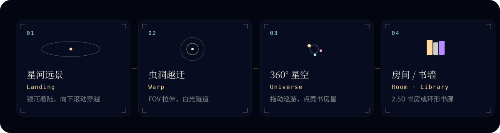

<p align="center">
  
</p>

# 一个人的书房 · 平行宇宙

> A Study of One's Own — 一间间书房化作星辰，在银河里漫游。

「一个人的书房」播客的沉浸式展示 demo：从银河着陆页穿越虫洞，进入 360° 星空漫游；每颗星是一位朗读者的书房，点击进入 2.5D 房间详情，查看朗读书目并试读有声样片；「星空图书馆」以 3D 环形书墙陈列全部有声书。

线上预览：<https://shufang-galaxy.summercommences.com>

<p align="center">
  
</p>

## 技术栈

- Vite 7 + React 19 + TypeScript
- Tailwind CSS 3.4 + shadcn/ui
- Three.js（@react-three/fiber + drei）
- GSAP / framer-motion / zustand

## 本地开发

```bash
npm install
npm run dev      # http://localhost:3000
```

本地 `npm run dev` 会用内存模拟 `/api/echoes`，刷新进程后留言清空；无需配置数据库。

## 构建与部署

```bash
npm run build    # 产物输出到 dist/
```

推送到 `main` 分支后由 GitHub Actions（`.github/workflows/deploy.yml`）自动构建并发布到 GitHub Pages。

### 宇宙回声（公共留言墙）

留言对所有访客可见，需后端存储。推荐用 **Vercel + KV（Upstash Redis）**：

1. 将本仓库导入 [Vercel](https://vercel.com)，Framework 选 Vite（已含 `vercel.json`）。
2. 在项目里添加 **Upstash Redis / KV** 集成（会注入 `KV_REST_API_URL`、`KV_REST_API_TOKEN`）。
3. 部署后，前端通过同域 `/api/echoes` 读写公共回声。
4. 在 Upstash / Vercel 控制台可查看 Redis 列表键 `shufang-galaxy:echoes:v1` 管理留言；可选邮箱在 `shufang-galaxy:echo-emails:v1`（不对外返回）。

**网页审核 / 删除**

1. 在 Vercel → Environment Variables 新增 `ECHOES_ADMIN_SECRET`（自设强密码）→ Redeploy  
2. 浏览器打开：`https://你的域名/#/admin/echoes`（或 `https://shufang-galaxy.vercel.app/#/admin/echoes`）  
3. 输入密钥后可查看全部公开留言（含可选邮箱）并删除  

本地开发默认密钥为 `dev-echoes-admin`（可用环境变量 `ECHOES_ADMIN_SECRET` 覆盖）。

若前端仍托管在 GitHub Pages，可只把 API 部署到 Vercel，并在 Pages 构建时设置：

```bash
VITE_ECHOES_API=https://你的项目.vercel.app/api/echoes
```

可选环境变量见 `.env.example`（`ECHOES_CORS_ORIGIN` 等）。

## 内容数据

| 文件 | 说明 |
| --- | --- |
| `public/assets/rooms.json` | 朗读者房间：名称、星色、图片、留言、朗读书目与单集 |
| `public/assets/books.json` | 星空图书馆书目与单集 |
| `public/assets/rooms/*.jpg` | 房间图片 |
| `public/assets/audio/*.mp3` | 朗读样片音频 |
| `api/echoes.ts` | 公共回声 API（Vercel Serverless） |
| `shared/echoes.ts` | 留言协议与校验（前后端共用） |

更新内容只需修改上述 JSON 与素材文件，无需改动代码。
